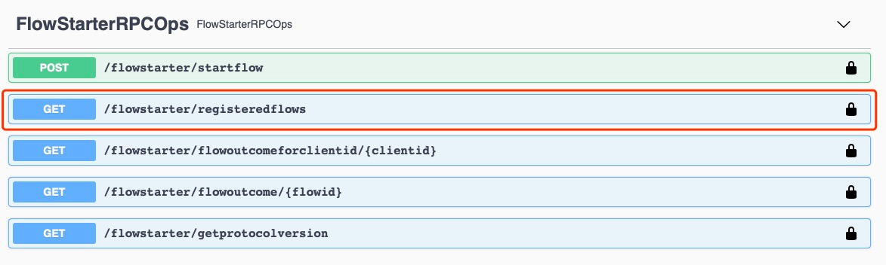

# Corda5 Cordapp Template 

## Environment Requirements: 
1. Download and install Java 11
2. Download and install `cordapp-builder` 
3. Download and install `corda-cli` 

You can find detailed instructions for steps 2 - 3 at [here](https://docs.r3.com/en/platform/corda/5.0-dev-preview-1/getting-started/overview.html)

## App Functionalities 
This app is a skeleton Corda 5 Cordapp. The app has a TemplateState, a TemplateStateContract, and a TemplateFlow. The flow will send a p2p transaction that carries the TemplateState to the target party. The TemplateState always carries a Hello-World String. 

## How to run the template

Corda 5 re-engineers the test development experience, utilizing Docker for test deployment. We need to follow a couple of steps to test deploy the app. 
```
#1 Build the projects.
./gradlew clean build

#2 Create the cpb file from the compiled cpk files in both contracts and workflows.
cordapp-builder create --cpk contracts/build/libs/corda5-template-contracts-1.0-SNAPSHOT-cordapp.cpk --cpk workflows/build/libs/corda5-template-workflows-1.0-SNAPSHOT-cordapp.cpk -o template.cpb

#3 Configure the network.
corda-cli network config docker-compose template-network

#4 Create a docker compose yaml file and start the docker containers.
corda-cli network deploy -n template-network -f c5cordapp-template.yaml | docker-compose -f - up -d
    .
    . This step will take a few mintues to complete. If you are wondering what is running behind the scene,
    . open a new terminal and run: docker-compose -f docker-compose.yaml logs -f 
    
#5 Install the cpb file into the network.
corda-cli package install -n template-network template.cpb
```
All the steps are combined into a shell script called run.sh - you can simply call `sh ./run.sh` in your terminal and that will sequentially run steps 1 to 5. 

You can always look at the status of the network with the command: 
```
corda-cli network status -n template-network
```
You can shut down the test network with the command: 
```
corda-cli network terminate -n template-network -ry
```
So far, your app is successfully running on a Corda 5 test deployment network. 

## Interact with the app 
Open a browser and go to `https://localhost:<port>/api/v1/swagger`

For this app, the ports are: 
* PartyA's node: 12112
* PartyB's node: 12116

NOTE: This information is in the status printout of the network. Use the status network command documented above if you want to check the ports. 

The url will bring you to the Swagger API interface. It's a set of HTTP APIs which you can use out of the box. In order to continue interacting with your app, you need to log in. 

Depending on the node that you chose to go to, you need to log into the node use the correct credentials. 

For this app, the logins are: 
* PartyA - Login: angelenos, password: password
* PartyB - Login: londoner, password: password

NOTE: This information is in the c5cordapp-template.yaml file. 

Let's test if you have successfully logged in by going to the RegisteredFlows:



You should see a 200 success callback code, and a response body that looks like: 
```
[
  "net.corda.c5template.flows.TemplateFlow"
]
```

Now, let's look at the `startflow` API. We will test our templateFlow with it.

In the request body for `startflow` in Swagger, enter: 
```
{
  "rpcStartFlowRequest": {
    "clientId": "launchpad-2", 
    "flowName": "net.corda.c5template.flows.TemplateFlow", 
    "parameters": { 
      "parametersInJson": "{\"msg\": \"Hello-World\", \"receiver\": \"C=GB, L=London, O=PartyB, OU=INC\"}" 
    } 
  } 
}
```
This request carries three pieces of information: 
1. The clientID of this call 
2. The flow we are triggering 
3. The flow parameters that we are providing. 

After the call, you should see a 200 success call code, and a response body that looks like: 
```
{
  "flowId": {
    "uuid": "81e1415e-be7c-4038-8d06-8e76bdfd8bc7"
  },
  "clientId": "launchpad-2"
}
```
NOTE: This does not mean the transaction is passed through, it means the flow is successfully executed, but the success of the transaction is not guaranteed. 

You would need either go to `flowoutcomeforclientid` or `flowoutcome` to see the result of the flow. In this case, we will use the clientID to query the flow result: 

Enter the clientID of our previous flow call: `launchpad-2`

You should see the following response: 
```
{
  "status": "COMPLETED",
  "resultJson": "{ \n \"txId\" : \"SHA-256:D2A3CEBB7C8E1FA7F35CBA9D9DA6076521D543235EE2867B047FEE8B893CB2EC\",\n \"outputStates\" : [\"{\\\"msg\\\":\\\"Hello-World\\\",\\\"sender\\\":\\\"OU\\u003dLLC, O\\u003dPartyA, L\\u003dLos Angeles, C\\u003dUS\\\",\\\"receiver\\\":\\\"OU\\u003dINC, O\\u003dPartyB, L\\u003dLondon, C\\u003dGB\\\"}\"], \n \"signatures\": [\"UnYM33YZ0G6//FrYNJh6mAfsm9SWfsD1p/aNHWm0focWg+uxp627fV7iuFpubq/t1ufb8yNo0/Awlcs9/b+tBg==\", \"T/0lOTwVKIRtWydTL2KbF4Q1XPeJaN+NkIv9by5unJ1jLDAJ89rfxTuytc5xQvyLQfPtnHIrtK42jzpFO8osAA==\"]\n}",
  "exceptionDigest": null
}
```
The completed status of the flow that both the flow and its carried transaction were successful. 

Now we have completed a full cycle of running a flow!
